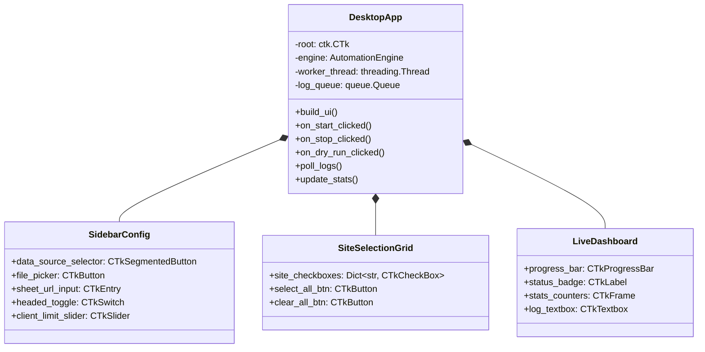

# Client Signup Automation Bot — Implementation Plan

This document outlines the end-to-end technical implementation plan for the automated client registration system. The plan supports dual data sources (**Google Sheets** and **Local Excel via `Test.xlsx`**), dynamic promo links, 9 target betting platforms, a **modern Desktop GUI Application (`customtkinter`)**, and a **multi-modal logging and diagnostic framework**.

---

## User Review Required

> [!IMPORTANT]
> **Desktop GUI Application Addition:**
> In addition to the CLI and batch scripts, a full **CustomTkinter Desktop GUI Application** will be built:
> 1. **Interactive Control Panel:** Choose data source (`Excel` vs `Google Sheets`), browse and pick `.xlsx` workbooks, select target websites via checkboxes, toggle Headed/Headless mode, and set client batch limits.
> 2. **Live Execution Feed & Progress Dashboard:** Multi-threaded non-blocking execution with real-time progress bar, live log console, and statistics counters (Success, Failed, Skipped).
> 3. **Results & Artifact Inspector:** Quick access to view generated account credentials and open `logs/artifacts/` screenshots in Windows File Explorer.
> 4. **One-Click Desktop Launch:** `run_desktop_app.bat` or `python gui_app.py`.

---

## Desktop GUI Architecture & Layout



---

## Target Websites & IP Accessibility Status

| # | Bookmaker / Target | Configured Promo URL | Link Type | Live IP Status | Rollout Stage |
|---|---|---|---|---|---|
| 1 | **Fairplay Bet** | `https://fairplaybet.co.uk/` | Direct Registration | **Accessible (HTTP 200)** | **Stage 1 (Local Experiments with `Test.xlsx`)** |
| 2 | **Star Sports (OLBG)** | `https://www.olbg.com/free-bets/star-sports` | OLBG Affiliate Outlink | **Portal Accessible (HTTP 200)** | Stage 1 (Portal) / Stage 2 (Target) |
| 3 | **Betfred** | `https://www.betfred.com/promotion/sports-onboarding-bet-10-get-10?...` | Direct Promo | **Geo-Restricted (403)** | Stage 2 (UK VPS) |
| 4 | **QuinnBet** | `https://www.quinnbet.com/uk/offers/sports-welcome-offer-ukcb50lo` | Direct Offer | **Cloudflare Geo-block (403)** | Stage 2 (UK VPS) |
| 5 | **BresBet** | `https://bresbet.com/?promo=welcomeb10g10&keyword=bresbet&...` | Direct Promo | **Geo-Restricted (403)** | Stage 2 (UK VPS) |
| 6 | **Planet Sport Bet** | `https://href.li/?https://planetsportbet.com/?account=static-resource-carousel-promo-terms&promoId=12746` | Referrer-stripped Promo | **Geo-Restricted (403)** | Stage 2 (UK VPS) |
| 7 | **Betting Lounge #1** | `https://bettinglounge.co.uk/out/aYBjbREAACoASoCM/?offer=betting` | Affiliate Redirect (Bet St George) | **Geo-Restricted (UK/IE only)** | Stage 2 (UK VPS) |
| 8 | **Betgoodwin (OddsMonkey)** | `https://hub.oddsmonkey.com/betgoodwin` | OddsMonkey Affiliate Outlink | **Affiliate Geo-block** | Stage 2 (UK VPS) |
| 9 | **Betting Lounge #2** | `https://bettinglounge.co.uk/out/ZRKfXhAAACkAStm/?offer=betting` | Affiliate Redirect | **HTTP 404 (Expired Campaign)** | Stage 2 (Update URL via config) |

---

## Proposed Project Structure

```text
data_entry_bot/
│
├── config/
│   ├── promo_links.json         # Configurable promo links & affiliate mapping
│   └── settings.py              # Application settings, timeouts, logging config
│
├── core/
│   ├── logger.py                # Multi-sink logging & FailureBundle capturer
│   ├── browser.py               # Playwright browser & context manager (with tracing)
│   ├── engine.py                # Workflow executor (Client × Site matrix)
│   ├── state.py                 # SQLite / JSON persistent state tracker
│   └── password_gen.py          # Compliant strong password generator
│
├── data/
│   ├── __init__.py
│   ├── base_provider.py         # Abstract DataProvider interface
│   ├── google_sheets.py         # Google Sheets reader & writer (gspread)
│   ├── excel_provider.py        # Excel reader & writer (tuned for Test.xlsx)
│   ├── factory.py               # DataProvider factory (sheets vs excel)
│   └── models.py                # Pydantic Client and RegistrationResult models
│
├── gui/
│   ├── __init__.py
│   └── main_gui.py              # CustomTkinter modern desktop GUI app
│
├── sites/
│   ├── __init__.py
│   ├── base.py                  # BaseSiteAdapter with built-in logging & diagnostics
│   ├── fairplaybet.py           # Fairplay Bet adapter (Stage 1 Live Experiment)
│   ├── betfred.py               # Betfred registration adapter (Stage 2)
│   ├── quinnbet.py              # QuinnBet registration adapter (Stage 2)
│   ├── bresbet.py               # BresBet registration adapter (Stage 2)
│   ├── planetsportbet.py        # Planet Sport Bet adapter (Stage 2)
│   ├── starsports.py            # Star Sports (OLBG outbound) adapter (Stage 2)
│   ├── betgoodwin.py            # Betgoodwin (OddsMonkey outbound) adapter (Stage 2)
│   └── affiliate_redirects.py   # Betting Lounge affiliate redirect handler (Stage 2)
│
├── logs/
│   ├── bot.log                  # Rolling general operational log
│   ├── error.log                # Dedicated errors-only log
│   └── artifacts/               # Failure bundles: screenshots, DOM dumps, traces
│
├── Test.xlsx                    # Sample client test workbook
├── app.py                       # CLI entry point
├── gui_app.py                   # Desktop GUI entry point
├── run_desktop_app.bat          # Desktop 1-click launcher for GUI
├── run_bot.bat                  # Desktop 1-click batch runner (CLI)
├── requirements.txt             # Python dependencies
└── README.md                    # Setup, configuration & user manual
```

---

## Phased Implementation Plan

### Phase 1 — Project Scaffold, Dependencies & Core Logger
- Initialize virtual environment with Python 3.11+.
- Configure `requirements.txt` (`playwright`, `customtkinter`, `gspread`, `openpyxl`, `pandas`, `pydantic`, `loguru`).
- Implement `core/logger.py` with multi-sink logging and failure bundle capture.

### Phase 2 — `Test.xlsx` & Google Sheets Data Providers
- Implement `data/excel_provider.py` specifically tailored for `Test.xlsx`.
- Implement `data/google_sheets.py` with identical schema mapping.
- Implement Pydantic `Client` schema in `data/models.py`.

### Phase 3 — State Management & Playwright Engine
- Implement `core/state.py` and `core/browser.py`.
- Implement `core/engine.py` connecting providers, state, and browser contexts.

### Phase 4 — Site Adapters Layer
- Implement `sites/base.py` and concrete adapters for all 9 platforms.

### Phase 5 — Desktop GUI Application (`gui/main_gui.py`)
- Build CustomTkinter window with sleek dark theme:
  - Data source switcher (`Excel` file picker vs `Google Sheets` URL).
  - Target site checklist with select-all/clear controls.
  - Headed/Headless toggle and client limit slider.
  - Start, Dry-Run, and Stop control buttons.
  - Multi-threaded execution keeping GUI 100% smooth.
  - Real-time logging console textbox and progress bar.
- Create `gui_app.py` and `run_desktop_app.bat`.

### Phase 6 — Verification & Testing
- Unit tests via `pytest`.
- Live GUI launch and execution test.
- Verify real-time log streaming and progress updating in GUI.

### Phase 7 — Documentation & Deployment
- Complete `README.md` with GUI user guide and screenshots.

---

## Verification Plan

### Automated & Unit Tests
- `pytest tests/`: Verifies data models, state, password generator, and Excel providers.

### Manual & Integration Verification
1. **Desktop GUI Launch**:
   - Run `python gui_app.py` to verify all widgets, dark theme, and buttons render cleanly.
2. **Interactive Run via GUI**:
   - Select `Test.xlsx`, check `Fairplay Bet`, set Headed mode = ON, click "Start Automation", and observe live log streaming and progress bar updating.
